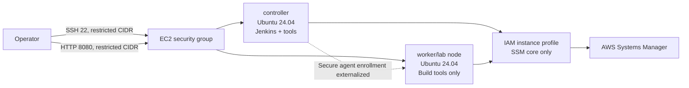

# Jenkins controller and Ubuntu lab worker

Terraform provisions a small, repeatable DevOps lab in AWS: two Ubuntu Server
24.04 LTS EC2 instances, a configurable network/security group, and optional
least-privilege IAM instance profiles. The hosts are intentionally separate.
The controller runs Jenkins. The worker is a separate build host and does not
install Jenkins.

## Status and scope

**Status:** infrastructure and host bootstrap are implemented; CI validation is
implemented; application CI/CD pipelines and Jenkins agent enrollment are not.
This is a foundation for a lab, not a production Jenkins service. No credentials,
agent secrets, SSH trust material, or access keys are generated.

## Architecture



The default VPC mode uses the first available subnet in the account default VPC.
`vpc_mode = "create"` creates a small public VPC/subnet/route table; production
deployments should use a reviewed network design and private subnets where
possible. Public IP assignment is configurable.

## Repository structure

```text
.
├── ec2.tf                         # controller and worker instances
├── iam.tf                         # EC2 role, profile, and SSM policy attachment
├── vpc.tf                         # default, created, or existing VPC selection
├── security-group.tf              # configurable SSH/Jenkins/web ingress
├── variables.tf                   # inputs and validations
├── outputs.tf                     # IDs, public/private IPs, SSH and Jenkins URL
├── versions.tf                    # Terraform and provider constraints
├── scripts/
│   ├── controller-user-data.sh    # controller bootstrap
│   └── worker-user-data.sh        # worker bootstrap
├── .github/workflows/
│   └── terraform.yml              # fmt/init/validate/TFLint/Checkov
├── .tflint.hcl                    # AWS TFLint ruleset
└── terraform.tfvars.example       # safe configuration example
```

## Technology

| Area | Implementation |
| --- | --- |
| IaC | Terraform >= 1.5, AWS provider ~> 5.0 |
| Operating system | Ubuntu Server 24.04 LTS amd64 AMI |
| Compute | Two configurable EC2 instances (default `t3.medium`) |
| Containers | Docker Engine from Docker's official apt repository and Compose plugin |
| Kubernetes tools | Stable `kubectl` and Helm; kubeadm/kubelet are not installed by default |
| Cloud tooling | AWS CLI v2 official installer and Terraform HashiCorp apt repository |
| Automation | Jenkins and Java 21 on controller; Java 21 on worker |
| Access | EC2 key pair, IMDSv2, optional SSM |
| Static CI | GitHub Actions, TFLint, Checkov |

## Prerequisites and authentication

Install Terraform >= 1.5 and have an AWS account with permission to create the
selected VPC/subnet, security group, EC2 instances, IAM role/profile, and key
pair. Use AWS CLI configuration, environment variables, or another standard
AWS provider credential chain. Never put credentials in `terraform.tfvars`,
user data, GitHub Actions, or this repository.

By default, Terraform creates an ED25519 key pair named `jenkins-lab-key` and
uses it for both instances. After apply, save the sensitive private-key output
locally and never commit it:

```bash
terraform output -raw generated_private_key > jenkins-lab-key.pem
chmod 400 jenkins-lab-key.pem
```

The private key is stored in Terraform state, so protect the state as carefully
as a secret. An existing key pair can still be used by setting
`key_pair_mode = "existing"` and providing `existing_key_name`.

## Configuration and deployment

```bash
cp terraform.tfvars.example terraform.tfvars
# Set narrow allowed_ssh_cidr/allowed_jenkins_cidr values.
terraform init
terraform fmt -recursive
terraform validate
terraform plan
terraform apply
```

Important inputs include:

* `aws_region`, `name_prefix`
* `vpc_mode`, `existing_vpc_id`, `existing_subnet_id`
* `controller_instance_type`, `worker_instance_type`, `root_volume_size`
* `key_pair_mode`, `existing_key_name`, `new_key_pair_name`
* `allowed_ssh_cidr` and `allowed_jenkins_cidr` (required; set these to the
  operator/VPN CIDRs, normally `x.x.x.x/32`, rather than relying on a broad default)
* `associate_public_ip_address` and `enable_public_web_ingress`
* `create_iam_instance_profile` or `iam_instance_profile_name`

The default security group allows SSH and Jenkins only from the two configured
CIDRs. HTTP/HTTPS ingress is disabled. Do not use `0.0.0.0/0` for administration
or Jenkins except briefly in an isolated test.

Availability Zones are selected automatically. Terraform queries AWS for
available offerings for both instance types, intersects those AZs with the
region's available AZs, and then selects the first compatible subnet. This
prevents a subnet such as `us-east-1e` from being selected when `t3.medium` is
unsupported there. For an existing subnet, Terraform preserves that subnet and
the checks fail early if its AZ cannot run both instance types.
When public IP assignment is enabled, Terraform also verifies that the selected
subnet has a usable default internet/NAT route. This catches the common SSH
failure where an instance has a public address but its subnet is private.

## Outputs, IPs, and SSH

After apply, inspect all values with:

```bash
terraform output
terraform output ssh_commands
terraform output controller_private_ip
terraform output worker_private_ip
```

Outputs include controller/worker instance IDs, public IPs (when public
addressing is enabled), private IPs, SSH command examples, the controller
Jenkins URL, and a sensitive generated private key when requested. Example SSH:

```bash
ssh -i <private-key> ubuntu@<controller-public-ip>
ssh -i <private-key> ubuntu@<worker-public-ip>
```

For private instances, use SSM Session Manager or a bastion/VPN path instead of
opening SSH publicly. The SSM role is attached automatically when the module
creates its profile.

## Host bootstrap and tool verification

Terraform passes `scripts/controller-user-data.sh` and
`scripts/worker-user-data.sh` as EC2 user data. Both scripts are idempotent for
package/repository installation, log to
`/var/log/jenkins-controller-bootstrap.log` or
`/var/log/jenkins-worker-bootstrap.log`, fail fast, and print a verification
summary. The controller installs Java 21, Git, Docker Engine/Compose, AWS CLI v2,
Terraform, kubectl, Helm, and Jenkins. The worker installs Java 21, Git, Docker
Engine/Compose, AWS CLI v2, Terraform, kubectl, and Helm. They use
`/var/lib/jenkins-lab/downloads` for downloads and do not
write credentials.

On either host, start a new SSH session after Docker group membership changes:

```bash
git --version
docker --version
docker compose version
kubectl version --client
helm version
aws --version
terraform version
```

Retrieve the initial Jenkins password only on the relevant host:

```bash
sudo cat /var/lib/jenkins/secrets/initialAdminPassword
```

## Jenkins controller versus worker

The `controller` is the Jenkins UI and orchestration host. The `worker` contains
Java and the build tools but no Jenkins service. This repository deliberately
does not place an agent secret, SSH private key, or Jenkins credential in
Terraform. To connect the worker, use Jenkins' SSH Build Agents plugin with a
credential stored in Jenkins Credentials, or use an inbound WebSocket agent with
the secret injected at runtime from AWS Secrets Manager/SSM. The worker can
then be registered in Jenkins using that externalized credential. Installing
Jenkins on the worker alone would not create a Jenkins worker.

## CI flow and CI/CD distinction

`.github/workflows/terraform.yml` runs on pull requests and pushes to `main`:

1. Checkout.
2. Install Terraform and TFLint.
3. Run `terraform fmt -check -recursive`.
4. Run offline `terraform init`.
5. Run `terraform validate`.
6. Initialize and run TFLint.
7. Run Checkov against Terraform.

The workflow has read-only contents permission and performs no plan or apply.
This is **CI** (formatting, static analysis, and validation), not deployment
**CD**. Jenkins pipelines, artifact promotion, approvals, drift detection, and
automatic infrastructure deployment are intentionally outside this repository.
Checkov skips only documented context-dependent findings: public IPs and the
optional public subnet support lab SSH, HTTP/HTTPS is explicitly opt-in,
unrestricted outbound traffic is needed for package updates, and VPC flow logs
or default-VPC controls require account-wide resources outside this lab. EC2
detailed monitoring and EBS optimization are enabled directly.

## Security and state

IMDSv2 is required, root disks are encrypted gp3 volumes, and IAM uses the
AWS-managed `AmazonSSMManagedInstanceCore` policy only by default. Review that
policy and add no broader permissions unless required by a workload. Restrict
CIDRs, protect Terraform state with encryption/access controls and locking, and
do not commit `terraform.tfvars`, state files, generated keys, or logs.

## Troubleshooting

* **No Jenkins page:** verify the controller public/private route, the
  `allowed_jenkins_cidr`, `systemctl status jenkins`, and the bootstrap log.
* **SSH denied:** check the key pair, effective public IP, subnet route, and
  `allowed_ssh_cidr`; avoid changing the group to world-open.
  Confirm the instance is running Ubuntu and use the `ubuntu` user:

  ```bash
  ssh -i jenkins-lab-key.pem ubuntu@<public-ip>
  ```

  In AWS, confirm the instance has the expected public IPv4 address, the
  security group allows TCP 22 from your current public IP, the subnet route
  table has `0.0.0.0/0` to an Internet Gateway (or use SSM/VPN for private
  subnets), and the network ACL permits return traffic. Confirm the EC2
  `key_name` matches the private key; user data cannot repair a wrong key pair.
  Useful checks are:

  ```bash
  aws ec2 describe-instances --instance-ids <instance-id> \
    --query 'Reservations[0].Instances[0].{State:State.Name,PublicIp:PublicIpAddress,Subnet:SubnetId,Key:KeyName,SG:SecurityGroups[*].GroupId}'
  aws ec2 describe-route-tables --filters Name=association.subnet-id,Values=<subnet-id>
  aws ec2 describe-network-acls --filters Name=association.subnet-id,Values=<subnet-id>
  ```

  The default network ACL allows traffic unless it was changed outside this
  project. Existing VPC, subnet, route table, and NACL changes are not managed
  or recreated by this configuration.
* **Tool missing:** inspect the relevant bootstrap log and rerun only after
  correcting the underlying apt/network issue; user data runs at first boot.
* **Docker permission denied:** reconnect so the `ubuntu` group membership is
  refreshed, or use `sudo` temporarily.
* **SSM unavailable:** confirm the profile is attached, the instance has
  outbound access or VPC endpoints, and the SSM agent is running.

## Cleanup

Review the plan and remove all lab resources when finished:

```bash
terraform plan -destroy
terraform destroy
```

If an existing VPC, subnet, security group, key pair, or IAM profile was
supplied, Terraform does not own or destroy those external resources.

## Roadmap

Possible follow-up work includes private-subnet/NAT or VPC-endpoint examples,
remote encrypted state with locking, HTTPS via a reverse proxy/load balancer,
CloudWatch/bootstrap health reporting, Jenkins configuration-as-code, and a
separately reviewed secure agent enrollment workflow.

## Interview and resume summary

This project demonstrates Terraform module design, AWS EC2/VPC/IAM security,
IMDSv2 and encrypted storage, reproducible Ubuntu bootstrapping, Docker and
Kubernetes tooling installation, and policy-as-code CI. A concise resume entry:

> Built a Terraform-managed Ubuntu 24.04 Jenkins lab with separate controller
> and worker EC2 nodes, least-privilege SSM IAM profiles, restricted security
> groups, reproducible tool bootstrap, and GitHub Actions validation using
> TFLint and Checkov.
